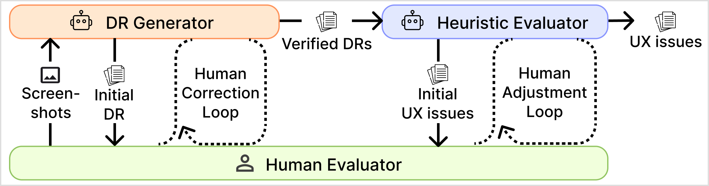

# Human-AI Collaborative Mobile App UX Evaluation System

**A Multi-Agent System Architecture for Automated Heuristic Evaluation**

> **Research Prototype** for AAAI'26 Workshop Submission
> Demonstrating human-centered AI through iterative human-AI collaboration in UX evaluation

---

## Abstract

Heuristic evaluation is a widely used method for assessing and improving mobile app UX designs but remains resource-intensive, requiring human experts. Recent efforts to automate this process using multimodal large language models (MLLMs) show promise but continue to face challenges in reliability and transparency, which may stem from limited human–AI collaboration.

To address these issues, we propose a **multi-agent system (MAS) architecture** integrating two specialized MLLM agents—the **Design Representation Generator** and the **Heuristic Evaluator**—with a human evaluator through **iterative Correction and Adjustment Loops**. This architecture enhances reliability and transparency through sequential, structured analysis steps and iterative human-AI interaction loops, embodying human-centered AI principles by positioning AI as a collaborator rather than a replacement.

This repository contains the prototype implementation based on our proposed MAS architecture, developed using GPT-4o with Retrieval-Augmented Generation and an interactive dual-panel interface.

---

## 🎯 Research Contributions

### 1. Multi-Agent System (MAS) Architecture
- **Design Representation Generator Agent**: Analyzes mobile app screenshots to create structured task flow descriptions
- **Heuristic Evaluator Agent**: Identifies UX issues based on established heuristic principles
- **Sequential Analysis Pipeline**: Structured two-phase workflow ensuring systematic evaluation

### 2. Human-Centered AI Collaboration
- **Iterative Correction and Adjustment Loops**: Enables human evaluators to refine and validate AI outputs at each phase
- **Interactive Dual-Panel Interface**: Combines live-updating JSON dashboards with conversational AI agents
- **Canvas-Mode Paradigm**: Distinguishes between modification requests and informational queries for seamless interaction

### 3. Enhanced Reliability and Transparency
- **Structured Analysis Steps**: Breaks down complex evaluation into manageable, verifiable stages
- **Retrieval-Augmented Generation (RAG)**: Grounds evaluations in established UX terminology and heuristic principles
- **Explicit Reasoning**: AI agents provide justifications for identified issues based on violated heuristics

---

## 🏗️ System Architecture



The system consists of three key components:

- **Design Representation (DR) Generator**: Analyzes mobile app screenshots and generates structured task flow descriptions in JSON format
- **Heuristic Evaluator**: Identifies UX issues by evaluating task flows against established heuristic principles
- **Human Evaluator**: Iteratively refines and validates AI-generated outputs through natural language interaction at each phase

---

## 🔬 Key Technical Features

### 1. Retrieval-Augmented Generation (RAG)
- **Terminology Definitions** (`Terms_and_definitions.md`): Establishes shared vocabulary for task flow analysis
- **Heuristic Principles** (`heuristics.md`): Provides evidence-based evaluation criteria
- **File Search Integration**: AI agents access reference documents during analysis

### 2. Structured Prompt Engineering
- **Design Representation Generator Prompt**: Guides systematic screenshot analysis and task flow modeling
- **Heuristic Evaluator Prompt**: Directs two-phase evaluation (flow-level and interaction-level)
- **Canvas Mode Instructions**: Enables intelligent distinction between feedback and questions

### 3. Multi-Modal LLM Integration
- **Model**: GPT-4o (multimodal capabilities for screenshot analysis)
- **API**: OpenAI Responses API with system-level instructions
- **Image Processing**: Base64 encoding for up to 16 screenshots per evaluation

### 4. Interactive Refinement Mechanisms
- **Intent Recognition**: Automatically classifies user messages as modification requests or questions
- **Dynamic Updates**: JSON outputs update in real-time based on human feedback
- **Conversation History**: Maintains context across multiple refinement iterations

---

## 📊 Evaluation Results

Our prototype was evaluated on **5 task scenarios** from **4 smartphone apps**, generating **35 UX issues**. Expert review by **4 UX professionals** demonstrated:

- **85%** Factual Accuracy
- **97%** Task Scenario Relevance
- **74%** Expert Alignment

These results indicate that our human-AI collaborative approach, supported by the MAS architecture, achieves **efficient and robust UX evaluation** while **reducing expert workload** and **preserving transparency**.

---

## 🚀 Installation and Setup

### Prerequisites

- Python 3.10 or higher
- OpenAI API key with access to GPT-4o
- Conda or virtualenv (recommended)

### 1. Clone the Repository

```bash
git clone <repository-url>
cd prototype_AAAI-26
```

### 2. Create Virtual Environment

```bash
conda create -n aaai26 python=3.10 -y
conda activate aaai26
```

### 3. Install Dependencies

```bash
pip install -r requirements.txt
```

### 4. Configure API Key

Set your OpenAI API key as an environment variable:

```bash
export OPENAI_API_KEY="your-api-key-here"
```

### 5. Run the Application

```bash
python app.py
```

The web interface will launch at `http://localhost:7860`

---

## 📁 Project Structure

```
.
├── app.py                              # Main Gradio application with MAS implementation
├── utils.py                            # Utility functions (API calls, JSON parsing)
├── requirements.txt                    # Python dependencies
│
├── prompt_dr_generator.md              # System prompt for DR Generator agent
├── prompt_heuristic_evaluator.md       # System prompt for Heuristic Evaluator agent
│
├── Terms_and_definitions.md            # RAG: UX terminology definitions
├── heuristics.md                       # RAG: Heuristic evaluation principles
│
└── README.md                           # This file
```

---

## 🎨 Usage Workflow

### Phase 1: Design Representation Generation

1. **Upload Screenshots**: Select multiple screenshots showing a complete task flow
2. **AI Analysis**: DR Generator agent analyzes screens and generates structured task flow JSON
3. **Human Refinement**: Review and refine the generated design representation through natural language
4. **Validation**: Confirm when the design representation accurately captures the task flow

**Output**: Structured JSON containing:
- Screen identifications and purposes
- User activities per screen
- Interaction sequences
- Navigational triggers

### Phase 2: Heuristic Evaluation

1. **Automatic Transition**: Confirmed DR automatically feeds into Heuristic Evaluator
2. **Two-Level Analysis**:
   - **Flow-Level**: Identifies issues across the entire task journey
   - **Interaction-Level**: Detects issues within specific screen interactions
3. **Human Refinement**: Adjust issue descriptions, severity scores, and recommendations
4. **Export**: Download final UX issues as JSON

**Output**: Structured JSON containing:
- Problem descriptions
- Violated heuristic principles
- Importance scores (1-7 scale)
- Actionable recommendations

---

## 🔧 Technical Implementation Details

### Multi-Agent Coordination

```python
# Phase 1: DR Generator Agent
# Input: Screenshots only
response = client.responses.create(
    model="gpt-4o",
    instructions=dr_generator_prompt + canvas_instruction,
    input=[{
        "role": "user",
        "content": [{"type": "input_text", "text": "Analyze screenshots..."}] + screenshot_images
    }]
)

# Phase 2: Heuristic Evaluator Agent
# Input: Screenshots + DR JSON from Phase 1
response = client.responses.create(
    model="gpt-4o",
    instructions=heuristic_evaluator_prompt + canvas_instruction,
    input=[{
        "role": "user",
        "content": [
            {"type": "input_text", "text": f"Task Flow JSON:\n{dr_json}\n\nAnalyze UX issues..."}
        ] + screenshot_images
    }]
)
```

### Canvas Mode Interaction

**Modification Request Detection**:
```
User: "Make the screen_purpose more specific"
→ AI updates JSON + provides explanation
→ Output: <dashboard>updated_json</dashboard> + chat message
```

**Informational Query Detection**:
```
User: "What does navigational_interaction mean?"
→ AI maintains JSON + answers question
→ Output: Conversational response only
```

### Retrieval-Augmented Generation

Both agents use file search to access:
- `Terms_and_definitions.md`: Ensures consistent terminology
- `heuristics.md`: Grounds evaluation in established UX principles

---

## 📈 Performance Metrics

### Computational Efficiency

- **Phase 1 (DR Generation)**: 1-2 minutes for 5-10 screenshots
- **Phase 2 (Heuristic Evaluation)**: 1-2 minutes per task flow
- **Total Time**: ~3-4 minutes per complete evaluation (vs. hours for manual evaluation)

### Token Usage

- DR Generation: ~5,000-10,000 tokens (including images)
- Refinement iterations: ~500-2,000 tokens each
- Heuristic Evaluation: ~8,000-15,000 tokens (including images)

### Cost Estimate

- **Per Evaluation**: $0.10 - $0.50 (GPT-4o pricing)
- **Significantly reduces** expert time cost while maintaining quality

---

## 🔬 Research Applications

This prototype supports research in:

1. **Human-AI Collaboration**: Investigating effective collaboration patterns in UX evaluation
2. **Multi-Agent Systems**: Exploring sequential agent coordination for complex tasks
3. **Explainable AI**: Demonstrating transparent reasoning through structured outputs
4. **Automated UX Evaluation**: Advancing MLLM-based UX assessment methods
5. **Interactive Machine Learning**: Studying human-in-the-loop refinement processes

---

**Status**: Research Prototype
**Last Updated**: January 2025
**Conference**: AAAI'26 Workshop Submission
